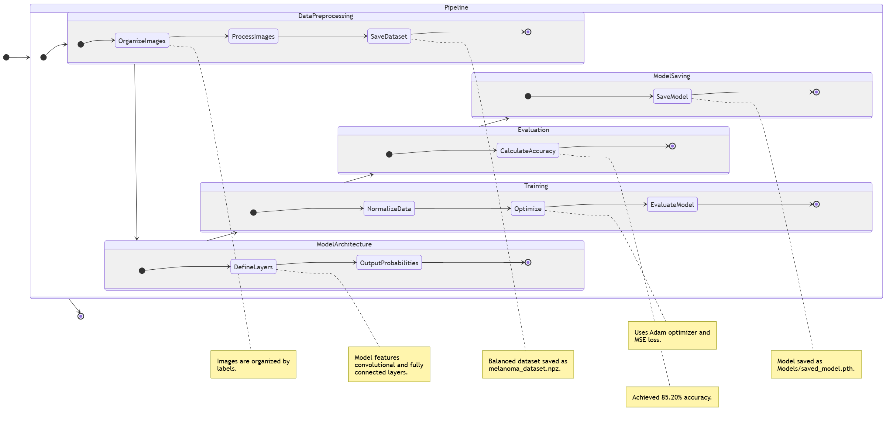
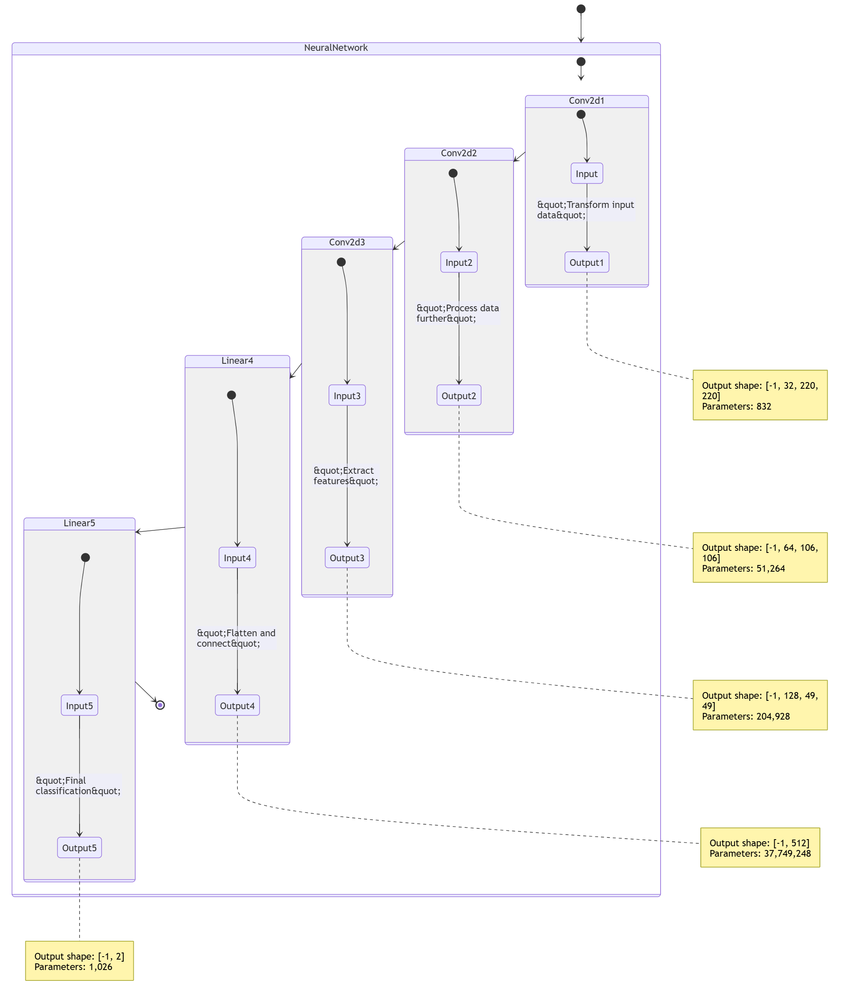

### Melanoma Classification Project Documentation >>>>

---

#### **Project Overview**
This project focuses on detecting melanoma (a type of skin cancer) using Convolutional Neural Networks (CNNs). The pipeline involves preprocessing the image dataset, training a deep learning model, and evaluating its performance. The primary goal is to classify skin lesions as either **benign** or **malignant** with high accuracy.

---

#### **Pipeline Description**

1. **Data Preprocessing**
   - **Input Dataset**:
     - Images are organized into folders based on their labels:
       - Benign: `melanoma_cancer_dataset/train/benign`, `melanoma_cancer_dataset/test/benign`
       - Malignant: `melanoma_cancer_dataset/train/malignant`, `melanoma_cancer_dataset/test/malignant`
   - **Processor**:
     - The `MelanomaDataProcessor` class handles loading, resizing, and normalizing images to grayscale with dimensions of 224x224 pixels.
     - It balances the training data by ensuring the number of benign samples matches the number of malignant samples.
   - **Output**:
     - Saves processed data as `melanoma_dataset.npz` for easy loading during training/testing.

2. **Model Architecture**
   - **Model**: `MelanomaCNN`
   - **Structure**:
     - **Convolutional Layers**:
       - 3 layers with 32, 64, and 128 filters respectively, kernel size of 5, and ReLU activation.
       - Max pooling is applied after each convolutional layer with a kernel size of 2x2 to reduce spatial dimensions.
     - **Fully Connected Layers**:
       - 1 hidden layer with 512 neurons (ReLU activation).
       - Output layer with 2 neurons for benign and malignant probabilities (softmax activation).
   - **Input Shape**: `(batch_size, 1, 224, 224)`
   - **Output Shape**: `(batch_size, 2)`

3. **Training**
   - **Data**:
     - Train dataset loaded from `melanoma_dataset.npz`.
     - Images normalized to a [0, 1] range by dividing pixel values by 255.
   - **Hyperparameters**:
     - Learning Rate: `0.0001`
     - Batch Size: `32`
     - Epochs: `2`
   - **Optimizer**:
     - Adam optimizer used for efficient gradient-based optimization.
   - **Loss Function**:
     - Mean Squared Error (MSE) loss to measure prediction error.
   - **Training Loop**:
     - For each epoch, data is divided into batches.
     - Forward pass calculates predictions, and loss is computed.
     - Backward pass updates weights using gradients.
     - Training accuracy achieved: **85.52%**

4. **Evaluation**
   - **Metrics**:
     - Accuracy calculated as the ratio of correct predictions to the total number of samples.
   - **Testing Accuracy**: **85.20%**
   - **Evaluation Loop**:
     - The model is evaluated on unseen test data using the same batch size as training.

5. **Model Saving**
   - The trained model is saved as `Models/saved_model.pth` for reuse or further evaluation.

---

#### **Key Classes and Functions**

1. **MelanomaDataProcessor**
   - Handles image preprocessing and dataset preparation.
   - Key Methods:
     - `load_and_process_image(image_path)`: Loads, converts to grayscale, resizes, and normalizes an image.
     - `process_directory(directory, label)`: Processes all images in a directory and assigns labels.
     - `process_dataset(data_config)`: Processes the entire dataset and returns training and testing splits.

2. **MelanomaCNN**
   - Implements the CNN for melanoma classification.
   - Key Methods:
     - `forward(x)`: Defines the forward pass through convolutional and fully connected layers.
     - `get_feature_dims(input_size)`: Debugging utility to calculate feature dimensions at each layer.

3. **Training Script**
   - Prepares data tensors (`train_X`, `train_y`).
   - Initializes the `MelanomaCNN` model.
   - Executes training using `Adam` optimizer and computes loss using `MSELoss`.

4. **Evaluation Script**
   - Runs the model in evaluation mode.
   - Computes accuracy for both training and testing datasets.

---

#### **Dataset Statistics**
- **Training Data**:
  - Benign: Equal to Malignant after balancing.
  - Malignant: Original count used.
- **Testing Data**:
  - Benign and Malignant samples used as provided.
- **Image Dimensions**: Resized to 224x224.

---

#### **Performance Metrics**
- **Training Accuracy**: **85.52%**
- **Testing Accuracy**: **85.20%**

### *Performance Metrics with pre-train**
- **Training Accuracy**: **94.22%**
- **Testing Accuracy**: **91.10%**
---

#### **Future Enhancements**
1. **Data Augmentation**:
   - Introduce techniques like flipping, rotation, and scaling to improve generalization.
2. **Loss Function**:
   - Experiment with cross-entropy loss for better classification performance.
3. **Additional Metrics**:
   - Include precision, recall, and F1-score for more robust evaluation.
4. **Hyperparameter Tuning**:
   - Optimize learning rate, batch size, and number of epochs.
5. **Model Improvements**:
   - Use pretrained models like ResNet or VGG16 for transfer learning.
6. **Visualization**:
   - Integrate Grad-CAM to visualize important regions in images contributing to predictions.

---

#### **File Structure**
.
Melamoma-Skin-cancer
├── melamoma_cancer_dataset
│   ├── test
│   │   ├── melanoma
│   │   └── benign
│   └── train
|       ├── melanoma
|       └── benign
├── melanoma_dataset.npz    # NumPy Array for the dataset (train_X, train_Y, test_X, test_Y)
├── melanoma_processing.log # store the log of the full Pipeline
├── Models
│   └── saved_model.pth
├── demo.py                  # demo script test model on data
├── melanomaNN.py            # Neural network model definition
├── preprocessing.py         # processing data from dataset
├── training.py              # Training script
├── testing.py               # Testing script
├── main.py                  # Main is Full Pipeline (from preprocessing --> evaluate the model accuracy)
└── README.md

