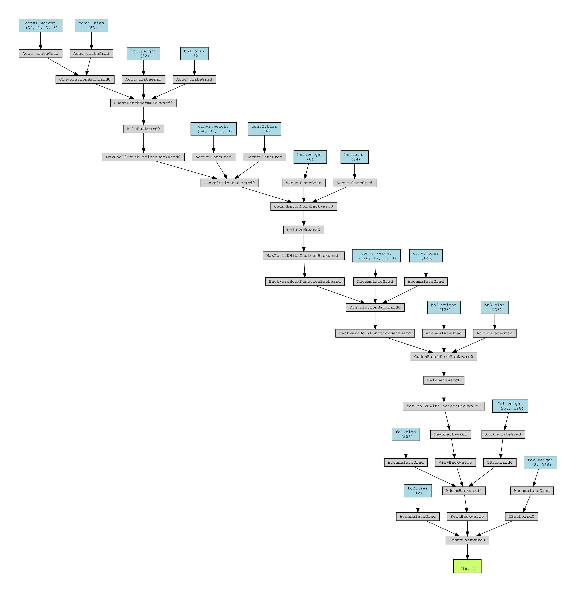
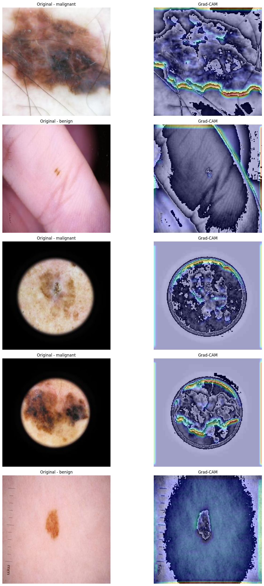

### Melanoma Classification Project Documentation

---

#### **Project Overview**
This project focuses on detecting melanoma (a type of skin cancer) using Convolutional Neural Networks (CNNs). The pipeline involves preprocessing the image dataset, training a deep learning model, and evaluating its performance. The primary goal is to classify skin lesions as either **benign** or **malignant** with high accuracy.

---


#### **Pipeline Description**

1. **Data Preprocessing**
   - **Input Dataset**:
     - Images are organized into folders based on their labels:
       - Benign: `melanoma_cancer_dataset/train/benign`, `melanoma_cancer_dataset/test/benign`
       - Malignant: `melanoma_cancer_dataset/train/malignant`, `melanoma_cancer_dataset/test/malignant`
   - **Processor**:
     - The `ImageFolder` class from PyTorch is used to load and process the dataset efficiently.
     - Images are resized to 224x224 pixels and normalized using standard ImageNet mean and standard deviation values.
   - **Data Augmentation**:
     - PyTorch's `torchvision.transforms` is utilized to apply augmentation techniques, including:
       - Random flipping (horizontal/vertical).
       - Random rotation (up to 30 degrees).
       - Scaling and cropping.
       - Adding Gaussian noise.
   - **Output**:
     - The processed dataset is used directly during training/testing via DataLoader for efficient batching and augmentation on-the-fly.



2. **Model Architecture**
   - **Model**: `MelanomaCNN`
   - **Structure**:
     - **Convolutional Layers**:
       - 3 layers with 32, 64, and 128 filters respectively, kernel size of 5, and ReLU activation.
       - Max pooling is applied after each convolutional layer with a kernel size of 2x2 to reduce spatial dimensions.
     - **Fully Connected Layers**:
       - 1 hidden layer with 512 neurons (ReLU activation).
       - Output layer with 2 neurons for benign and malignant probabilities (softmax activation).
   - **Input Shape**: `(batch_size, 1, 224, 224)`
   - **Output Shape**: `(batch_size, 2)`
   - **Model Improvements**:
     - Pretrained models such as ResNet18 are used for transfer learning to enhance performance.

3. **Training**
   - **Data**:
     - Training and testing datasets are loaded using PyTorch DataLoader for batching and shuffling.
     - Images normalized to a [0, 1] range by dividing pixel values by 255.
   - **Hyperparameters**:
     - Learning Rate: `0.0001`
     - Batch Size: `32`
     - Epochs: `10`
   - **Optimizer**:
     - Adam optimizer used for efficient gradient-based optimization.
   - **Loss Function**:
     - Cross-entropy loss is used for better classification performance.
   - **Training Loop**:
     - For each epoch, data is divided into batches.
     - Forward pass calculates predictions, and loss is computed.
     - Backward pass updates weights using gradients.
     - Training accuracy achieved: **89.02%**

4. **Evaluation**
   - **Metrics**:
     - Accuracy calculated as the ratio of correct predictions to the total number of samples.
     - Additional metrics such as precision, recall, and F1-score are included for robust evaluation.
   - **Testing Accuracy**: **90.20%**
   - **Evaluation Loop**:
     - The model is evaluated on unseen test data using the same batch size as training.
   - **Visualization**:
     - Grad-CAM is integrated to visualize important regions in images contributing to predictions.

5. **Model Saving**
   - The trained model is saved as `Models/saved_model.pth` for reuse or further evaluation.

---

#### **Key Classes and Functions**

1. **MelanomaDataProcessor**
   - Handles image preprocessing and dataset preparation using PyTorch utilities.
   - Key Methods:
     - `ImageFolder`: Loads images from the directory and applies preprocessing transforms.
     - `DataLoader`: Batches the dataset and ensures efficient shuffling/loading during training/testing.


2. **MelanomaCNN**
   - Implements the CNN for melanoma classification.
   - Key Methods:
     - `forward(x)`: Defines the forward pass through convolutional and fully connected layers.
     - `get_feature_dims(input_size)`: Debugging utility to calculate feature dimensions at each layer.

3. **Training Script**
   - Prepares data loaders (`train_loader`, `test_loader`).
   - Initializes the `MelanomaCNN` model.
   - Executes training using `Adam` optimizer and computes loss using `CrossEntropyLoss`.

4. **Evaluation Script**
   - Runs the model in evaluation mode.
   - Computes accuracy, precision, recall, and F1-score for both training and testing datasets.

---

#### **Dataset Statistics**
- **Training Data**:
  - Benign: Equal to Malignant after balancing.
  - Malignant: Original count used.
- **Testing Data**:
  - Benign and Malignant samples used as provided.
- **Image Dimensions**: Resized to 224x224.

---

#### **Performance Metrics**
- **Training Accuracy**: **89.02%**
- **Testing Accuracy**: **90.40%**

### *Performance Metrics with Pre-trained Models*
- **Pretrained Model**: ResNet18
- **Training Accuracy**: **93.60%**
- **Testing Accuracy**: **91.98%**

---

#### **File Structure**
``` python
.
Melanoma-Skin-Cancer
├── melanoma_cancer_dataset
│   ├── test
│   │   ├── melanoma
│   │   └── benign
│   └── train
|       ├── melanoma
|       └── benign
├── melanoma_dataset.npz    # NumPy Array for the dataset (train_X, train_Y, test_X, test_Y)
├── melanoma_processing.log # Store the log of the full pipeline
├── Models
│   └── saved_model.pth
├── demo.py                  # Demo script to test model on data
├── melanomaNN.py            # Neural network model definition
├── preprocessing.py         # Processing data from dataset
├── training.py              # Training script
├── testing.py               # Testing script
├── pipeline.py              # Full pipeline (from preprocessing to evaluation)
├── config.py                # Configuration
├── dataset.py               # pytorch dataset and dataloader
├── streamlit.py             # streamlit UI for testing life data
└── README.md
```

#### Grad-CAM Visualization for Melanoma Classification:


